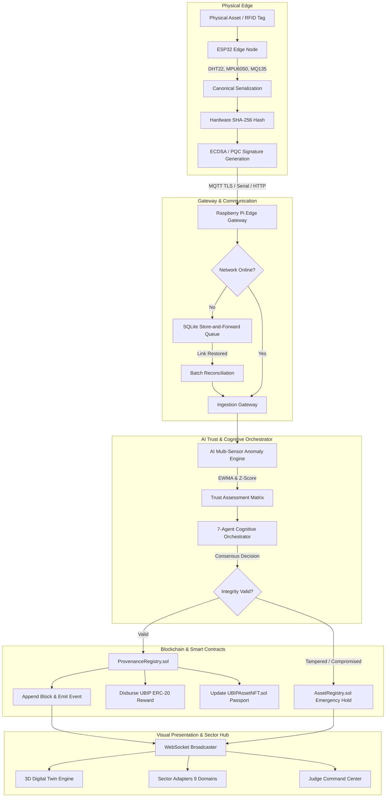

# UBIP-X System Architecture & Technical Specifications
> **Universal Blockchain Intelligence & Physical Trust Platform**  
> **SIH 2026 Problem Statement PS ID: 26211**

---

## 1. End-to-End Architectural Pipeline

---

## 2. Component Responsibility Matrix

| Technology / Layer | Purpose in UBIP-X | Inputs | Processing | Outputs | Real / Simulation |
| :--- | :--- | :--- | :--- | :--- | :--- |
| **Physical RFID (RC522)** | Hardware identity binding | Physical silicon UID | ISO14443A SPI reading | Canonical `rfid_tag` | Real Hardware / Sim |
| **ESP32 Edge Microcontroller** | Edge sensor intake & hashing | Raw analog/digital pins | Canonical serialization + SHA-256 | Signed canonical JSON | Real Hardware / Sim |
| **Raspberry Pi Gateway** | Store-and-forward edge buffering | Serial/MQTT packets | Schema validation + SQLite buffering | Synchronized HTTP uplink | Real Hardware / Sim |
| **AI Trust Engine** | Multi-sensor anomaly detection | Temperature, Vibration, Gas | Rolling EWMA + 3-sigma Z-Score | Multi-factor trust score | Real Deterministic Code |
| **SNN Spike Encoder** | Event-driven neuromorphic alert | Sensor deltas | Membrane potential integration | Action potential spike rate | Deterministic Sim |
| **Federated Learning** | Privacy-preserving model update | Local node gradients | Federated Averaging (FedAvg) | Global aggregated weights | Deterministic Sim |
| **Cognitive Orchestrator** | 7-agent consensus policy | Telemetry + Trust score | Multi-agent reasoning trace | Deterministic command | Real Autonomous Code |
| **ProvenanceRegistry.sol** | Immutable provenance ledger | Canonical hash, prevHash | Smart contract verification | Block inclusion + Event | Hardhat Local Blockchain |
| **AssetRegistry.sol** | Physical asset state & hold | Asset ID, State, Hold flag | Role-based state machine | On-chain asset freeze | Hardhat Local Blockchain |
| **UBIPToken (ERC-20)** | Validator rewards & credits | Validated block event | Mint 15 UBIP to validator | Updated token balance | Local ERC-20 Contract |
| **UBIPAssetNFT (ERC-721)** | Verifiable Digital Passport | Genesis hash, metadata URI | ERC-721 token minting | Verifiable NFT Passport | Local ERC-721 Contract |
| **Post-Quantum Crypto (PQC)**| Quantum-resistant signatures | Key pairs, telemetry message | ML-KEM-768 & ML-DSA-65 | Benchmark timings & verification | Real Software Benchmark |
| **3D Digital Twin (Three.js)**| Interactive spatial asset mirror| Live WebSocket telemetry | WebGL shaders, harmonic mesh | Interactive 3D visualization | Real WebGL Engine |
| **Sector Adapters** | 9-domain schema & policy rules | Active sector selection | Dynamic threshold & role mapping | Domain-adapted core | Real Pluggable Engine |

---

## 3. Off-Chain vs On-Chain Storage Protocol

In strict compliance with **UBIP-X Blockchain Storage Principle 8**:
- **OFF-CHAIN**: High-frequency raw sensor streams, continuous vibration waveforms, 3D CAD meshes, full PDF inspection reports, and raw AI training data are held off-chain on edge devices / IPFS.
- **ON-CHAIN**: Deterministic canonical SHA-256 hashes, previous parent hashes, digital signatures, asset state transitions, smart contract policy holds, and token/NFT ownership records are committed to the blockchain.
