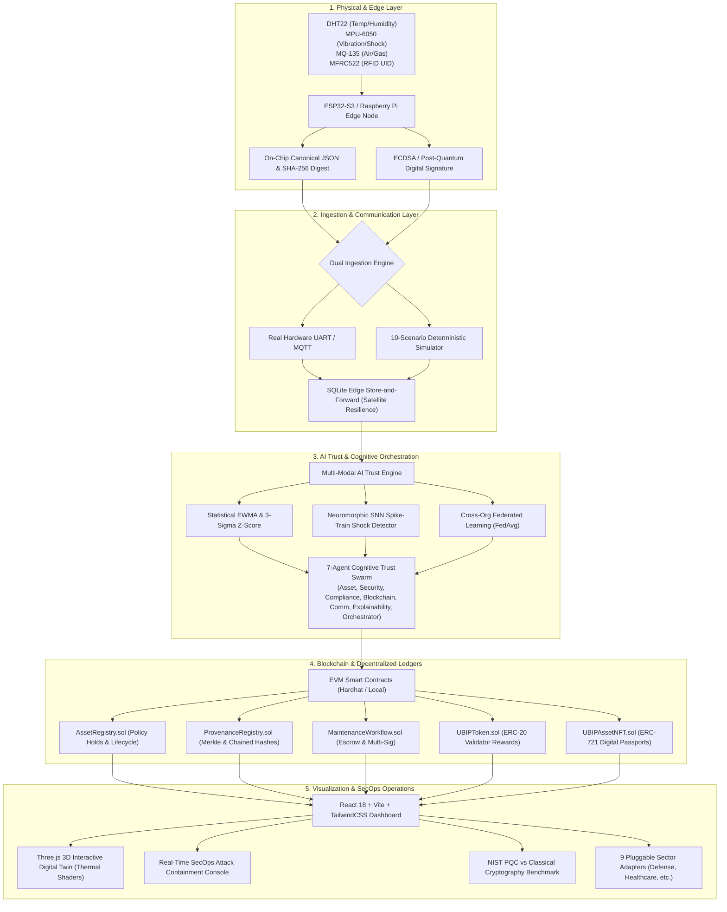

<div align="center">

# 🛡️ UBIP-X: Universal Blockchain Intelligence & Physical Trust Platform
### *From Physical Evidence to Verifiable Digital Trust*

[](https://www.sih.gov.in/)
[](#)
[](#)
[](#)
[](./LICENSE)

<br/>

**Smart India Hackathon (SIH 2026) | Problem Statement ID: 26211**  
**Organization:** AICTE | **Department:** AICTE, MIC-Student Innovation  

---

### 🌐 Live Modes for SIH Judges:
[⚡ 20-Step Guided SIH Demo (`/sih-demo`)](#-sih-2026-judge-evaluation-modes) • [📊 1-Screen Jury Command Matrix (`/judge-mode`)](#-sih-2026-judge-evaluation-modes) • [📖 Full Architecture Manual](./ARCHITECTURE.md) • [🔌 Hardware Pinout Guide](./HARDWARE_INTEGRATION.md)

</div>

---

## 📌 The Problem: The "Garbage-In, Garbage-Out" Physical Trust Gap

Blockchains guarantee **immutability**, but they do **NOT** guarantee **veracity**.

If a physical sensor is spoofed, an RFID tag cloned, or malicious firmware flashed onto an edge node, traditional blockchains faithfully record corrupted, forged data forever. This fundamental vulnerability threatens national infrastructure, defense logistics, cold-chain pharmaceuticals, and smart grids.

```
❌ Traditional Approach:
Physical World ➡️ [Unverified/Tampered Sensor] ➡️ Blockchain ➡️ Immutable Falsehood ❌

✅ UBIP-X Approach:
Physical World ➡️ [ESP32 Secure Enclave + RFID] ➡️ [On-Chip SHA-256] ➡️ [AI Anomaly + SNN Shock Engine] 
               ➡️ [7-Agent Cognitive Trust Orchestrator] ➡️ [EVM Smart Contracts + PQC Signatures] 
               ➡️ [3D Digital Twin & Live SecOps] ✅
```

---

## 💡 Executive Summary: What is UBIP-X?

**UBIP-X** is an autonomous, post-quantum-ready physical-to-digital trust platform designed to bridge physical hardware reality with decentralized blockchain ledgers.

UBIP-X anchors physical hardware identities (ESP32-S3 microcontroller, MFRC522 RFID reader, multi-sensor arrays) with **on-chip canonical SHA-256 serialization**, **NIST Post-Quantum Cryptography (ML-KEM-768 / ML-DSA-65)**, **neuromorphic Spiking Neural Networks (SNN)**, **EWMA/Z-score AI anomaly detection**, and an autonomous **7-Agent Cognitive Trust Orchestrator**. Data is verified, tokenized (ERC-20 utility + ERC-721 Digital Asset Passports), and visualized in real time via an interactive **Three.js 3D Digital Twin**.

---

## 🏗️ System Architecture & End-to-End Pipeline



---

## ⚡ Key Technical Innovations

### 1. 🛡️ Physical Hardware Root-of-Trust (Dual Mode)
- **Real Physical Edge Node**: ESP32-S3 firmware with MFRC522 RFID reader, DHT22 (temperature/humidity), MPU-6050 (tri-axial acceleration & mechanical shock), and MQ-135 (hazardous gas air quality).
- **On-Chip Canonical Hash Engine**: Microcontroller serializes telemetry in deterministic key order and computes cryptographic SHA-256 before RF transmission.
- **Hardware Simulator**: 1-click deterministic hardware simulator capable of injecting 10 real-world anomaly patterns for demonstrations without physical hardware attached.
- *Detailed specifications: [HARDWARE_INTEGRATION.md](./HARDWARE_INTEGRATION.md)*

### 2. ⛓️ Decentralized Blockchain & Token Economy
- **`AssetRegistry.sol`**: Manages hardware-bound device states, owner verification, and automated emergency policy holds upon tamper detection.
- **`ProvenanceRegistry.sol`**: Stores immutable cryptographic parent-hash chains validated by decentralized consensus.
- **`MaintenanceWorkflow.sol`**: Multi-signature technician dispatch, escrow-locked maintenance jobs, and tamper release protocols.
- **`UBIPToken.sol` (ERC-20)**: Automated micro-incentive tokenomics disbursing +15 UBIP tokens per validated telemetry batch to edge node operators.
- **`UBIPAssetNFT.sol` (ERC-721)**: Verifiable Digital Asset Passports minting immutable lifecycle credentials with off-chain IPFS genesis proofs.
- *Detailed smart contract audit: [BLOCKCHAIN.md](./BLOCKCHAIN.md)*

### 3. 🔬 Post-Quantum Cryptography (PQC) & Advanced Security
- **NIST FIPS 203 & 204 Implementation**: In-browser and server-side live benchmarking comparing **ML-KEM-768** (Key Encapsulation) and **ML-DSA-65** (Digital Signatures) against classical RSA-2048 and ECDSA.
- **Zero-Knowledge Proofs (ZKP)**: Tier-3 security clearance credential verification enabling technicians to prove authorization without exposing identity or credentials.
- **DNA Archival Simulation**: Synthetic high-density DNA binary storage encoding/decoding provenance records into biological base pairs (A, C, G, T).
- **Live Attack Simulator**: Real-time simulation of Data Tampering, Signature Forgery, Replay Attacks, and Rogue Node MITM with instant smart contract circuit breakers.
- *Detailed cryptography benchmark: [PQC.md](./PQC.md) & [SECURITY.md](./SECURITY.md)*

### 4. 🧠 AI Trust Engine & 7-Agent Cognitive Swarm
- **Statistical EWMA & 3-Sigma Z-Score**: Real-time dynamic sensor thresholding that adapts to gradual ambient drift while instantly flagging sudden anomalous deviations.
- **Neuromorphic Spiking Neural Network (SNN)**: Bio-inspired spike-train encoder modeling mechanical impact and vibration patterns to identify structural damage before total failure.
- **Cross-Organizational Federated Learning (FedAvg)**: Privacy-preserving edge model aggregation simulating federated weight updates across disparate enterprise nodes.
- **7 Autonomous Agents**:
  1. *Asset Agent*: Device lifecycle & operational state tracking.
  2. *Security Agent*: Attack detection, replay analysis, & threat containment.
  3. *Compliance Agent*: SLA verification & regulatory policy checks.
  4. *Blockchain Agent*: Gas-optimized transaction batching & smart contract triggers.
  5. *Communication Agent*: Edge connectivity & store-and-forward queue management.
  6. *Explainability Agent*: Natural language root-cause reasoning for operators.
  7. *Cognitive Orchestrator*: Master consensus & multi-agent conflict resolution.
- *Detailed AI architecture: [AI.md](./AI.md)*

### 5. 🛰️ Satellite & Offline Blackout Resilience
- **Store-and-Forward Edge Queue**: Integrated SQLite edge buffer retaining telemetry with monotonic sequence IDs during internet/satellite blackouts.
- **Zero Telemetry Loss**: Upon reconnection, edge buffers burst-transmit backlogged packets, and the smart contract verifies sequence continuity to prevent replay attacks.

### 6. 🎮 Interactive 3D Digital Twin
- **Three.js WebGL Engine**: Realistic CAD industrial turbine/asset visualization with live thermal shader heatmaps, vibration harmonic mesh oscillations, and status forcefield halos reflecting real-time physical sensor inputs.

### 7. 🌐 9 Multi-Sector Pluggable Domain Adapters
UBIP-X ships with native operational parameters and compliance checks for 9 distinct industries:
1. **Defense & Strategic Infrastructure** (Weaponry tamper seals, restricted access)
2. **Healthcare & Pharma** (Cold-chain vaccine temperature integrity)
3. **Smart Logistics & Cargo** (Intermodal shipping container shock & location)
4. **Heavy Manufacturing** (Turbine vibration & predictive maintenance)
5. **Energy & Smart Grid** (Transformer load & hazardous gas emissions)
6. **Agri-Tech** (Soil moisture, grain silo climate control)
7. **Education & Credentials** (Tamper-proof academic diploma verification)
8. **Government & Public Records** (Land registry & municipal asset tracking)
9. **Aviation & Aerospace** (Airframe stress & structural fatigue)
- *Sector adapter documentation: [SECTOR_ADAPTERS.md](./SECTOR_ADAPTERS.md)*

---

## 🏆 SIH 2026 Judge Evaluation Modes

We have integrated dedicated evaluator tools directly into the UI for rapid jury verification:

| Evaluator Feature | Route / Access | Purpose & Demonstration Value |
| :--- | :--- | :--- |
| **⚡ SIH 20-Step Guided Demo** | `/sih-demo` | **1-Click Full System Walkthrough**: Automatically executes asset registration, telemetry ingestion, AI anomaly detection, tamper attack, smart contract hold, offline satellite blackout, auto-sync, sector switching, and PQC benchmark. |
| **📊 Judge Command Mode** | `/judge-mode` | **Single-Screen Executive Proof Matrix**: Consolidated view displaying on-chain transaction hashes, live telemetry streams, PQC performance metrics, and hardware failover status simultaneously. |
| **🤖 Operator AI Copilot** | Bottom Right Drawer | Natural language diagnostic copilot grounded in live sensor telemetry, Hardhat contract state, and incident audit logs. |
| **🎯 Attack Simulator** | `/security` | Live interactive demonstration of cyber attacks (tamper, replay, forgery) and immediate circuit-breaker lockdowns. |

*Quick reference for judges: [SIH_JUDGE_ONE_MINUTE.md](./SIH_JUDGE_ONE_MINUTE.md) and [JUDGE_GUIDE.md](./JUDGE_GUIDE.md)*

---

## 📊 SIH Jury Rubric Mapping

| SIH Evaluation Criteria | UBIP-X Solution | Codebase Module / Proof |
| :--- | :--- | :--- |
| **Innovation & Novelty (25%)** | Bridges physical sensors to blockchain via on-chip canonical hashing, SNN neuromorphic shock detection, and post-quantum NIST cryptography. | `edge/esp32/`, `server/src/pqc/`, `server/src/ai/` |
| **Technical Feasibility & Architecture (25%)** | Modular full-stack TypeScript + Solidity + React + WebGL. Deterministic dual-mode hardware ingestion ensures zero deployment friction. | `blockchain/contracts/`, `server/`, `client/` |
| **Hardware & Edge Integration (15%)** | ESP32-S3, MFRC522 RFID, DHT22, MPU-6050, MQ-135 sensors with store-and-forward satellite resilience. | `edge/`, `HARDWARE_INTEGRATION.md` |
| **Cybersecurity & Future-Proofing (15%)** | NIST FIPS 203 (ML-KEM-768) & 204 (ML-DSA-65), Zero-Knowledge Proof credentials, live attack simulator. | `server/src/pqc/`, `SECURITY.md`, `PQC.md` |
| **Completeness & Polish (10%)** | Fully functional UI, Three.js 3D Digital Twin, 20-step automated SIH tour, comprehensive documentation suite. | `client/src/components/`, `DEMO_GUIDE.md` |
| **Scalability & Societal Impact (10%)** | 9 pluggable industry sectors (Defense, Health, Agri, Logistics, Energy), ERC-20 validator micro-incentives. | `SECTOR_ADAPTERS.md`, `CAPABILITY_MATRIX.md` |

---

## 🛠️ Quick Start & Installation

### 1. Prerequisites
- **Node.js**: `>= 18.0.0`
- **npm**: `>= 9.0.0`
- **Git**: Installed

### 2. Setup & Execution (1 Command)
```bash
# 1. Clone the repository
git clone https://github.com/jaganbala2007/ubip-x.git
cd ubip-x

# 2. Install dependencies across all modules
npm install
npm --prefix server install
npm --prefix client install

# 3. Start both backend (Port 5000) and frontend (Port 3000)
npm run dev
```

Open your browser at `http://localhost:3000` to access the UBIP-X Control Center.

### 3. Running Automated Tests
```bash
npm test
```

---

## 📁 Repository Directory Structure

```
.
├── .gitignore                  # Production-grade git exclusions
├── LICENSE                     # MIT Open Source License
├── CONTRIBUTING.md             # Developer & Jury contribution guide
├── README.md                   # Executive jury overview & platform manual
│
├── blockchain/                 # EVM Solidity Smart Contracts
│   └── contracts/
│       ├── AssetRegistry.sol          # Physical asset state & policy holds
│       ├── ProvenanceRegistry.sol     # Chained cryptographic hash audits
│       ├── MaintenanceWorkflow.sol    # Multi-sig technician escrow & repairs
│       ├── UBIPToken.sol              # ERC-20 validator micro-incentive token
│       └── UBIPAssetNFT.sol           # ERC-721 Digital Asset Passport
│
├── edge/                       # Physical & Simulated Edge Hardware
│   ├── esp32/                  # ESP32-S3 C++ firmware, MFRC522, I2C sensor drivers
│   ├── raspberry-pi/           # Edge broker daemon, UART bridge & MQTT publisher
│   └── schemas/                # Canonical packet specs & SHA-256 schemas
│
├── server/                     # Backend Processing Engine (Node.js + Express + TS)
│   └── src/
│       ├── ai/                 # EWMA, 3-sigma Z-score, SNN shock detector, FedAvg
│       ├── agents/             # 7-Agent Cognitive Trust Orchestrator Swarm
│       ├── pqc/                # NIST FIPS 203 / 204 PQC benchmarks & ZKP proofs
│       ├── edge/               # Ingestion handlers, SQLite edge queue, attack simulator
│       └── sectors/            # 9 sector-specific adapters & validation rules
│
├── client/                     # High-Fidelity Frontend (React 18 + Vite + Three.js)
│   └── src/
│       ├── components/
│       │   ├── layout/         # Navigation, Sidebar, Status Indicators
│       │   ├── three/          # Three.js 3D Digital Twin & Thermal Shaders
│       │   └── views/          # SIH Demo, Judge Mode, SecOps, Assets, PQC
│       └── store/              # Centralized reactive state management
│
└── docs/                       # Technical Deep-Dive Documentation
    ├── ARCHITECTURE.md         # End-to-end technical architecture & dataflow
    ├── HARDWARE_INTEGRATION.md # ESP32 pinouts, wiring schematics & UART specs
    ├── SIH_JUDGE_ONE_MINUTE.md # 60-second executive cheat sheet for jury
    ├── JUDGE_GUIDE.md          # Scoring rubric alignment & evaluation paths
    ├── DEMO_GUIDE.md           # Step-by-step presentation script
    ├── PQC.md                  # Quantum vulnerability & NIST PQC benchmarks
    ├── SECURITY.md             # Threat modeling, attack mitigation & ZKP
    ├── BLOCKCHAIN.md           # Smart contract verification & gas optimization
    ├── AI.md                   # Anomaly detection & Multi-agent consensus
    ├── SECTOR_ADAPTERS.md      # 9 domain configurations & compliance rules
    ├── CAPABILITY_MATRIX.md    # Comprehensive system feature matrix
    ├── SYSTEM_VALIDATION_REPORT.md # Verification & benchmark test outputs
    ├── FINAL_BUILD_REPORT.md   # Build integrity & deployment verification
    ├── TESTING.md              # Automated testing instructions
    └── LIMITATIONS.md          # Transparent disclosure of constraints & roadmap
```

---

## 👥 Team & Acknowledgments

- **Team Name**: UBIP-X Team
- **Hackathon**: Smart India Hackathon (SIH 2026)
- **Problem Statement**: PS ID 26211
- **Special Thanks**: AICTE, Ministry of Education's Innovation Cell (MIC), and jury members for their guidance and evaluation.

---

<div align="center">
<b>UBIP-X: Securing the physical-to-digital future of national critical infrastructure.</b>
</div>
